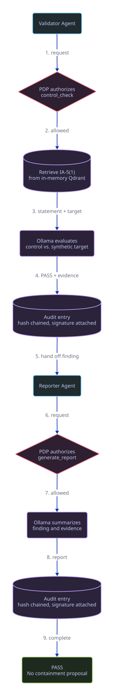
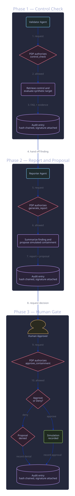

# Compliance Lab

Compliance Lab is a local prototype for exploring authorization boundaries in an AI-assisted compliance workflow.  A validator checks a synthetic system against an illustrative control record, a reporter summarizes the result, and a policy decision point limits which role may perform each action.  A failed check can produce a simulated containment proposal that requires a human decision before the workflow continues.

This repository is a research and demonstration project.  It does not assess a real system, make a compliance determination, or implement production security controls.

## What the prototype demonstrates

- A two-role workflow built with LangGraph and AutoGen
- Separate Ed25519 identities for the validator, reporter, and human approver during a run
- Explicit, in-process authorization decisions for the control check, report, and approval actions
- Retrieval of a generated 20-control NIST OSCAL subset from an in-memory Qdrant collection
- A human approval gate before simulated containment
- A hash-chained JSONL audit log with signatures attached to entries
- A CLI demonstration and a browser dashboard with static and live modes

## Security boundaries

The project models several security concepts without providing their production implementations:

- Identity keys are generated in memory for each run.  The project does not provide key persistence, rotation, revocation, or a trust registry.
- Authorization policy is hard-coded and evaluated in the application process.  It is not an external policy enforcement point and cannot constrain tools outside this workflow.
- Audit entries form a hash chain, but the verifier operates on the entries held by the running process and does not verify entry signatures.  The log file is not protected from deletion, truncation, or replacement.
- Containment execution is simulated.  Approval records the proposed action and advances the workflow; it does not alter a host, account, or network resource.
- The dashboard listens on `127.0.0.1` by default.  The application has not been reviewed or hardened for exposure to untrusted networks.
- The included control statements are mechanically extracted from a pinned official NIST OSCAL catalog.  The subset is incomplete, leaves organization-defined parameters unassigned, and must not be used as a compliance baseline.

These limits are part of the experiment: the repository shows where identity, authorization, approval, and audit decisions occur so that stronger implementations can replace the local components later.

## Workflow

The PASS path ends after the reporter summarizes a successful control check.

<p align="center">
  <a href="docs/diagrams/pass-path.svg">
    
  </a>
</p>

The FAIL path asks a human to approve or deny a simulated containment proposal.

<p align="center">
  <a href="docs/diagrams/containment-path.svg">
    
  </a>
</p>

## Requirements

- Python 3.11 through 3.13; the checked-in `.python-version` selects Python 3.13
- [uv](https://docs.astral.sh/uv/)
- [Ollama](https://ollama.com/) for live model and embedding calls

The automated tests use test doubles and do not require Ollama.

## Set up and test

```bash
uv sync --frozen --extra web --group dev
uv run pytest -q
uv run ruff check .
```

## Run the CLI demo

Start Ollama and retrieve the two default local models:

```bash
ollama serve
ollama pull llama3.2:3b
ollama pull nomic-embed-text
```

In another terminal, run:

```bash
uv run python scripts/demo.py
```

If the modeled check fails, the CLI asks whether to approve or deny the proposed simulated containment action.

## Run the dashboard

For the static replay, which does not require Ollama:

```bash
cd web
python3 -m http.server 8080 --bind 127.0.0.1
```

Open `http://127.0.0.1:8080`, select a PASS or FAIL path, and step through the recorded workflow.

For a live run against Ollama:

```bash
uv run python web/server.py
```

Open `http://127.0.0.1:8080` and select **Live Run**.  The dashboard sends the human approval decision back to the local workflow over a WebSocket.

## Repository layout

- `compliance_lab/`: identity, authorization, audit, agent, retrieval, and workflow code
- `tests/`: automated test suite
- `data/targets/`: fabricated target data using the `SYNTH-*` naming convention
- `data/controls/`: generated NIST OSCAL statement subset and provenance
- `scripts/demo.py`: CLI demonstration
- `scripts/build_control_subset.py`: deterministic OSCAL subset generator
- `web/`: static replay and live dashboard
- `docs/diagrams/`: workflow diagrams and D2 sources
- `THIRD_PARTY_NOTICES.md`: source attribution and upstream terms

## Reference material

The selected control statements come from public NIST OSCAL content.  The generated file records the source tag, commit, catalog version, OSCAL version, source hash, and transformation:

- [NIST SP 800-53 Rev. 5, Security and Privacy Controls for Information Systems and Organizations](https://csrc.nist.gov/pubs/sp/800/53/r5/upd1/final)
- [NIST SP 800-53 Rev. 5 OSCAL content, release v1.4.0](https://github.com/usnistgov/oscal-content/tree/v1.4.0/src/nist.gov/SP800-53/rev5/xml)

The project is not affiliated with or endorsed by NIST.
